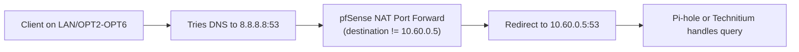

# pfSense Rule Set: Force DNS on LAN + All VLANs

This runbook enforces DNS redirection to your local resolver (`10.60.0.5`) across:
- LAN (`10.1.0.0/24`)
- Office / OPT2 (`10.10.0.0/24`)
- Family / OPT3 (`10.20.0.0/24`)
- IoT / OPT4 (`10.30.0.0/24`)
- Media / OPT5 (`10.40.0.0/24`)
- Guest / OPT6 (`10.50.0.0/24`)

## Why this is needed
Right now, redirect NAT is only on LAN. VLAN clients can still bypass your DNS filter by hardcoding public DNS on port 53.

## Prerequisites
- DNS server IP remains `10.60.0.5` (Pi-hole now, Technitium later).
- Existing inter-VLAN firewall policy still allows DNS to `10.60.0.5`.

## Step 1: Create pfSense aliases
Path: `Firewall > Aliases`

Create host alias:
- Name: `LOCAL_DNS`
- Type: `Host(s)`
- Value: `10.60.0.5`

Recommended (if Caddy uses DNS-01 with Cloudflare):
- Name: `CADDY_HOST`
- Type: `Host(s)`
- Value: `10.10.0.5`

Optional (cleaner descriptions):
- Name: `DNS_CLIENT_INTERFACES`
- Type: `Network(s)`
- Values: `LAN net`, `Office net`, `Family net`, `IoT net`, `Media net`, `Guest net`

## Step 2: Create NAT Port Forward rules (one per interface)
Path: `Firewall > NAT > Port Forward`

Create 6 rules, one each on: `LAN`, `OPT2`, `OPT3`, `OPT4`, `OPT5`, `OPT6`.

If LAN rule already exists and matches these fields, keep it and only add the missing VLAN rules (`OPT2` to `OPT6`).

Use these exact fields for each rule:
- Interface: `<that interface>`
- Address Family: `IPv4`
- Protocol: `TCP/UDP`
- Source: `<that interface> net`
- Source Port: `any`
- Destination: `Single host or alias` = `LOCAL_DNS`
- Invert Match (destination): `checked` (this means destination is NOT `10.60.0.5`)
- Destination Port Range: `DNS (53)`
- Redirect target IP: `LOCAL_DNS`
- Redirect target port: `DNS (53)`
- Description: `Force DNS to LOCAL_DNS (<interface>)`
- Filter rule association: `Add associated filter rule`

Important:
- Keep these 6 NAT rules near the top of the Port Forward list.
- Do not apply this rule on `OPT7` (Adblock VLAN hosting the DNS server), to avoid self-redirection edge cases.

## Step 3: Clean up conflicting/obsolete firewall rules
Path: `Firewall > Rules`

For LAN:
- Disable or remove `Block all rogue DNS requests` (your current rule on LAN).

Reason:
- With NAT redirection + associated pass rules, that block rule is redundant.
- If moved above broad allows without careful matching, it can block legitimate redirected DNS.

For OPT3/OPT4/OPT5/OPT6:
- Keep `Pi-hole` pass rules (or associated pass from NAT) above RFC1918 block rules.

## Step 3b: Add DNS redirect exception for Caddy (ACME DNS-01)
Path: `Firewall > NAT > Port Forward`

If Caddy runs on a VLAN that is also force-redirected for DNS (example: `OFFICE` / `10.10.0.0/24`), edit that interface's forced DNS rule and exclude the Caddy host.

Example rule to edit:
- `Force DNS to LOCAL_DNS (OFFICE)`

Set:
- Source: `Invert Match` = checked
- Source type/value: `Address or Alias` = `CADDY_HOST`
- Source Port: `any` to `any` (do not set `DNS`)
- Destination: keep `Invert Match` checked and `LOCAL_DNS`
- Destination Port: keep `DNS (53)`
- Redirect target: keep `LOCAL_DNS:53`

Root cause this prevents:
- Forced DNS NAT can intercept Caddy's resolver lookups to public resolvers.
- In split-DNS environments, this makes Caddy see local zone `home.example.com` instead of public authority chain.
- Cloudflare DNS plugin then fails zone detection with `expected 1 zone, got 0 for home.example.com`.

## Step 4: Apply changes
- Save and `Apply Changes` in NAT and Rules tabs.

## Step 5: Verify enforcement
From one client in each segment (LAN + OPT2/3/4/5/6), run:

```bash
nslookup google.com 8.8.8.8
nslookup cloudflare.com 1.1.1.1
```

Expected result:
- Queries still succeed.
- In your DNS server logs (Pi-hole/Technitium), source appears as the client, proving interception is active.

Also verify internal name resolution:

```bash
nslookup proxmox.home.example.com
nslookup switchlite8poe.home.example.com
```

If using Caddy DNS-01, verify from Caddy host:
```bash
dig +short SOA home.example.com @1.1.1.1
```

Expected:
- Result should not be your local Technitium SOA (`dns01.home.example.com ...`).

## Optional hardening (recommended)
Port 53 forcing does not stop encrypted DNS bypass:
- DoT uses TCP `853`
- DoH uses HTTPS `443`

Minimum hardening:
- Add block rules for outbound TCP/UDP `853` on client VLANs.

Advanced hardening:
- Maintain alias lists of known DoH endpoints and block those on `443`.
- Or enforce egress via proxy/policy controls if you need strict DNS governance.

## Rule logic diagram


## Fast entry version
If you want one block per interface for direct UI entry, use:
- [pfsense-forced-dns-quick-entry.md](./pfsense-forced-dns-quick-entry.md)

Related hardening quick-entry:
- [pfsense-dot-doh-blocking-quick-entry.md](./pfsense-dot-doh-blocking-quick-entry.md)
