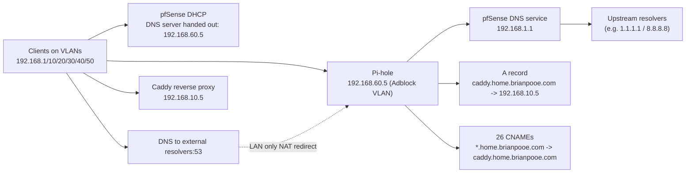
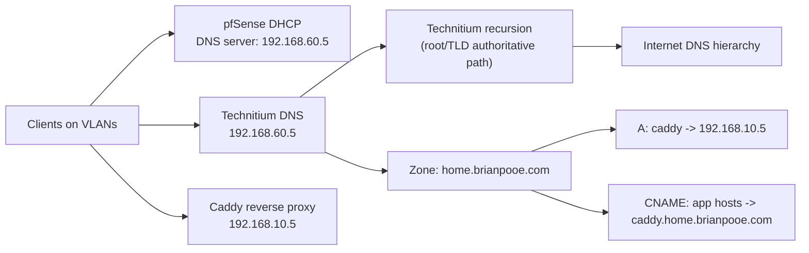

# pfSense + Pi-hole DNS Architecture Analysis and Technitium Mapping

## Scope and source files
- pfSense backup: `/Users/luda/Downloads/config-pfSense.home.arpa-20260301104624.xml`
- Pi-hole teleporter: `/Users/luda/Downloads/pi-hole-raspberrypihole-teleporter_2026-03-01_08-38-24.tar.gz`

## Executive summary
Your current design is solid and intentional:
- pfSense DHCP points clients to Pi-hole (`192.168.60.5`) on all major VLANs.
- Pi-hole serves local split-DNS for reverse-proxied apps via `caddy.home.brianpooe.com`.
- Pi-hole forwards upstream DNS to pfSense (`192.168.1.1`), then pfSense uses its configured upstream resolvers.
- Cross-VLAN isolation is enforced, with explicit exceptions for DNS to Pi-hole and selective access to Caddy.

Technitium can replace Pi-hole cleanly. The biggest migration requirement is preserving the same service IP (`192.168.60.5`) or updating every dependent DHCP/firewall/NAT reference.

## Current network and DNS components
- VLAN interfaces on pfSense:
  - LAN: `192.168.1.0/24`
  - Office (OPT2): `192.168.10.0/24`
  - Family (OPT3): `192.168.20.0/24`
  - IoT (OPT4): `192.168.30.0/24`
  - Media (OPT5): `192.168.40.0/24`
  - Guest (OPT6): `192.168.50.0/24`
  - Adblock (OPT7): `192.168.60.0/24`
- Pi-hole static DHCP mapping on Adblock VLAN:
  - `raspberrypihole` -> `192.168.60.5`
- Caddy static DHCP mapping on Office VLAN:
  - `raspberrypiproxy` -> `192.168.10.5`

## How pfSense and Pi-hole are connected

### 1. DHCP dependency (clients -> Pi-hole)
pfSense DHCP advertises `192.168.60.5` as DNS server for:
- LAN
- Office
- Family
- IoT
- Media
- Guest

This is the primary coupling between pfSense and Pi-hole.

### 2. DNS forwarding dependency (Pi-hole -> pfSense)
From Pi-hole backup:
- `PIHOLE_DNS_1=192.168.1.1`
- `PIHOLE_DNS_2=192.168.1.1`
- `server=192.168.1.1`

So every query path is:
1. Client -> Pi-hole (`192.168.60.5`)
2. Pi-hole -> pfSense (`192.168.1.1`)
3. pfSense DNS path -> upstream resolvers (for example `1.1.1.1` / `8.8.8.8` as configured in this backup)

Note:
- You confirmed your active setup is not using Unbound as part of the current design.

### 3. NAT DNS interception on pfSense
There is one DNS redirect NAT rule:
- Interface: `LAN` only
- Match: any source, destination `NOT 192.168.60.5`, port `53` TCP/UDP
- Redirect target: `192.168.60.5:53`

Important implication: forced redirect is currently configured only for LAN traffic, not all VLANs.

### 4. Firewall policy that enables segmented DNS
For Family/IoT/Media/Guest VLANs, you have explicit pass rules allowing DNS to `192.168.60.5:53` plus RFC1918 block rules. This is why segmented VLANs can still use centralized DNS.

### 4a. Per-segment behavior (what is effectively enforced)
| Segment | DHCP DNS handed out | Explicit allow to Pi-hole `192.168.60.5:53` | RFC1918 block rule | Caddy cross-VLAN allow (`192.168.10.5`) | DNS force-redirect NAT |
|---|---|---|---|---|---|
| LAN | Yes | Associated NAT pass rule exists | Yes (`Block all rogue DNS requests`) | N/A (LAN allow-any) | Yes (LAN only) |
| Office (OPT2) | Yes | No dedicated rule (allow-any policy) | No | Implicit via allow-any | No |
| Family (OPT3) | Yes | Yes | Yes | Yes | No |
| IoT (OPT4) | Yes | Yes | Yes | No | No |
| Media (OPT5) | Yes | Yes | Yes | Yes | No |
| Guest (OPT6) | Yes | Yes | Yes | No | No |

Interpretation:
- DNS centralization is primarily driven by DHCP, not global NAT interception.
- Isolation model is strong on OPT3/4/5/6 due to RFC1918 blocking plus explicit exceptions.
- Office VLAN is the least restricted of the VLANs shown.

### 5. Local service naming through Pi-hole
Pi-hole local DNS is doing two jobs:
- `custom.list` has:
  - `caddy.home.brianpooe.com -> 192.168.10.5`
- `05-pihole-custom-cname.conf` has 26 CNAME entries, e.g.:
  - `proxmox.home.brianpooe.com -> caddy.home.brianpooe.com`
  - `radarr.home.brianpooe.com -> caddy.home.brianpooe.com`
  - `paperless-ngx.home.brianpooe.com -> caddy.home.brianpooe.com`

### 6. Ad-blocking state
From Pi-hole teleporter:
- Adlists: 1 (StevenBlack hosts)
- Exact allowlist: 1 (`www.googleadservices.com`)
- Exact/regex deny lists: none
- Client groups: default group only (no per-client policy split)

## Diagram: current flow

## Where Gemini was correct vs needs correction

### Correct
- Technitium can replace Pi-hole and keep most pfSense-side design.
- Your CNAME-based app routing can be moved cleanly to Technitium zones.
- VLAN segmentation + explicit DNS access pattern is present.
- Pi-hole upstream currently points at pfSense (`192.168.1.1`).

### Needs correction
- "Forced DNS intercept" is not global right now:
  - NAT redirect rule is only on `LAN` interface.
- "Block rogue DNS" on LAN exists, but appears below broad LAN allow rules:
  - With default allow-first ordering, this specific block may not be doing what its label suggests.
- VLANs are not force-redirecting DNS to Pi-hole by NAT:
  - They rely on DHCP DNS assignment and explicit allow to Pi-hole.
  - Direct DNS to public resolvers on port 53 may still be possible from some VLANs unless separately blocked/redirected.

## Technitium mapping (feature-by-feature)

| Current function | Current implementation | Technitium equivalent | Migration action |
|---|---|---|---|
| Central DNS IP | Pi-hole at `192.168.60.5` | Technitium at `192.168.60.5` | Keep same IP to avoid touching multiple pfSense dependencies |
| DHCP DNS handout | pfSense DHCP -> `192.168.60.5` on VLANs | Same | No change needed if IP unchanged |
| Cross-VLAN DNS permit | Firewall pass rules to `192.168.60.5:53` | Same | No change needed |
| Forced DNS on LAN | NAT redirect to `192.168.60.5:53` | Same | No change needed |
| Local app DNS | `custom.list` + CNAME file | Authoritative zone in Technitium | Create `home.brianpooe.com` zone, add A for `caddy`, add CNAME records |
| Ad block list | StevenBlack in Pi-hole | Block List in Technitium | Add same list URL |
| Allowlist | `www.googleadservices.com` | Allow Zone / Whitelist | Add same domain |
| Upstream resolution | Pi-hole -> pfSense (`192.168.1.1`) -> upstream resolvers | Technitium recursive resolver or forwarders | Choose direct recursion or keep pfSense as upstream intentionally |

## Diagram: proposed with Technitium

## Practical migration checklist
1. Deploy Technitium on Raspberry Pi with IP `192.168.60.5` (or cutover with brief IP swap).
2. Recreate `home.brianpooe.com` zone:
   - Add `A` record `caddy.home.brianpooe.com -> 192.168.10.5`
   - Add all 26 CNAME records from current Pi-hole file.
3. Import StevenBlack block list and add allow entry for `www.googleadservices.com`.
4. Validate DNS from each VLAN (`dig/nslookup`) for:
   - public domain resolution
   - blocked ad domain
   - `proxmox.home.brianpooe.com` and other internal names
5. Cut traffic to Technitium (same IP preferred).
6. Optional hardening after cutover:
   - add DNS redirect/block on VLANs beyond LAN if you want true forced DNS everywhere
   - review LAN DNS block rule order
   - decide whether to allow/deny direct DNS-over-TLS and DNS-over-HTTPS egress

## Key risks to keep in mind
- If Technitium is not on `192.168.60.5`, you must update DHCP options, firewall rules, and NAT target references.
- DNS interception in your current config is partial (LAN-focused), not universal across all VLANs.
- IPv6 DNS policy is separate; current forced DNS logic is IPv4 (`inet`) only.

## Companion runbook
For step-by-step cutover execution and wildcard-vs-explicit record strategy, see:
- [technitium-cutover-checklist.md](./technitium-cutover-checklist.md)
