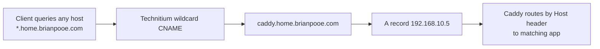

# Technitium Cutover Checklist (From Current pfSense + Pi-hole)

Start-here master flow:
- `/Users/luda/Documents/synology-docker-services/dns/end-to-end-migration-runbook.md`

## Short answer: do you need 26 CNAME records?
No, not if all your app hostnames should resolve to Caddy.

You can replace most manual CNAMEs with:
- `A` record: `caddy.home.brianpooe.com -> 192.168.10.5`
- wildcard `CNAME`: `*.home.brianpooe.com -> caddy.home.brianpooe.com`

This removes the need to add a new DNS record every time you add a new proxied service.

## Wildcard caveats (important)
- Wildcard does not cover the zone apex itself (`home.brianpooe.com`).
- Explicit records still override wildcard (this is good; you can keep special cases).
- A typo hostname will still resolve to Caddy; Caddy may return 404/cert mismatch until that host is configured there.
- Keep your reverse-proxy security policy in Caddy (host matching/auth), because DNS wildcard is broad by design.

## What your current data says
From Pi-hole backup:
- `caddy.home.brianpooe.com -> 192.168.10.5`
- 26 CNAMEs currently pointing to `caddy.home.brianpooe.com`

From your Caddyfile host blocks:
- 28 hostnames are defined in file.
- You marked these as no longer in use (excluded from active migration scope):
  - `jellyseerr.home.brianpooe.com`
  - `ollama.home.brianpooe.com`
  - `paperless-ai.home.brianpooe.com`
- Active hostnames in scope: 25.
- 1 active hostname exists in Caddy but is missing from Pi-hole CNAME list:
  - `switchlite8poe.home.brianpooe.com`
- 2 hostnames are in Pi-hole CNAME list but not currently in Caddy:
  - `seafile.home.brianpooe.com`
  - `tplink8pe.home.brianpooe.com`

A wildcard record closes this drift gap permanently.

## Cutover plan

### Docker stack files in this repo
- Compose template: `/Users/luda/Documents/synology-docker-services/docker-compose-files/technitium-dockhand_template.yaml`
- Deployment guide: `/Users/luda/Documents/synology-docker-services/dns/technitium-dockhand-deployment.md`

### 1. Keep network references stable
- Keep Technitium service IP as `192.168.60.5`.
- This avoids changing pfSense DHCP DNS settings, firewall allow rules, and LAN DNS redirect NAT target.

### 2. Deploy Technitium on Raspberry Pi
- Run Technitium container on the Adblock VLAN network reachable as `192.168.60.5`.
- Ensure TCP/UDP `53` reaches this container from all intended VLANs.

### 3. Create primary zone
- Zone name: `home.brianpooe.com`
- Zone type: Primary

### 4. Add DNS records (choose one model)

#### Model A: wildcard-first (recommended)
Create only these core records first:
- `A` `caddy.home.brianpooe.com` -> `192.168.10.5`
- `CNAME` `*.home.brianpooe.com` -> `caddy.home.brianpooe.com`

Optional explicit records for readability (not required if wildcard exists):
- `CNAME` `pihole.home.brianpooe.com` -> `caddy.home.brianpooe.com`
- `CNAME` `proxmox.home.brianpooe.com` -> `caddy.home.brianpooe.com`
- etc.

#### Model B: explicit-only (current behavior equivalent)
If you prefer explicit control, create:
- `A` `caddy.home.brianpooe.com` -> `192.168.10.5`
- CNAME records for each service:
  - `pihole.home.brianpooe.com`
  - `proxmox.home.brianpooe.com`
  - `nas.home.brianpooe.com`
  - `bazarr.home.brianpooe.com`
  - `emby.home.brianpooe.com`
  - `flaresolverr.home.brianpooe.com`
  - `gluetun.home.brianpooe.com`
  - `prowlarr.home.brianpooe.com`
  - `qbittorrent.home.brianpooe.com`
  - `radarr.home.brianpooe.com`
  - `sabnzbd.home.brianpooe.com`
  - `sonarr.home.brianpooe.com`
  - `tplink8pe.home.brianpooe.com`
  - `tplink16de.home.brianpooe.com`
  - `pbs.home.brianpooe.com`
  - `paperless-ngx.home.brianpooe.com`
  - `it-tools.home.brianpooe.com`
  - `bento-pdf.home.brianpooe.com`
  - `beszel.home.brianpooe.com`
  - `immich.home.brianpooe.com`
  - `speedtest.home.brianpooe.com`
  - `seafile.home.brianpooe.com`
  - `gramps.home.brianpooe.com`
  - `ytd.home.brianpooe.com`
  - `dav.home.brianpooe.com`
  - `seerr.home.brianpooe.com`

If using explicit-only, also add active Caddy hosts that currently have no Pi-hole entry:
- `switchlite8poe.home.brianpooe.com`

### 5. Recreate filtering behavior
- Add blocklist URL:
  - `https://raw.githubusercontent.com/StevenBlack/hosts/master/hosts`
- Add allowlist domain:
  - `www.googleadservices.com`

### 6. Choose upstream strategy in Technitium
Pick one:
- Least-change: forward to pfSense (`192.168.1.1`) first.
- Cleaner path: enable direct recursive resolution in Technitium.

### 7. Validate before full cutover
From a client in each VLAN, test:
- `nslookup proxmox.home.brianpooe.com 192.168.60.5`
- `nslookup switchlite8poe.home.brianpooe.com 192.168.60.5`
- `nslookup google.com 192.168.60.5`
- `nslookup www.googleadservices.com 192.168.60.5` (should be allowed)

Also test one blocked ad/tracker domain from query logs.

### 8. Cutover
- Stop Pi-hole service on `192.168.60.5`.
- Start Technitium on `192.168.60.5`.
- Confirm DNS responses and Caddy app access from each VLAN.

### 9. Rollback plan
If anything fails:
- Stop Technitium.
- Start Pi-hole back on `192.168.60.5`.
- Existing pfSense integration should recover immediately since IP dependencies are unchanged.

## Decision recommendation for your setup
Use Model A (wildcard-first).

Reason:
- Your Caddy host inventory changes over time and is already ahead of Pi-hole CNAME entries.
- Wildcard removes manual DNS drift while preserving the same user-facing URLs.

## DNS + proxy interaction (with wildcard)

## Related pfSense enforcement runbook
For exact NAT/firewall settings to force DNS across LAN + VLANs, see:
- `/Users/luda/Documents/synology-docker-services/dns/pfsense-forced-dns-all-vlans.md`
- `/Users/luda/Documents/synology-docker-services/dns/pfsense-forced-dns-quick-entry.md`
- `/Users/luda/Documents/synology-docker-services/dns/pfsense-dot-doh-blocking-quick-entry.md`
