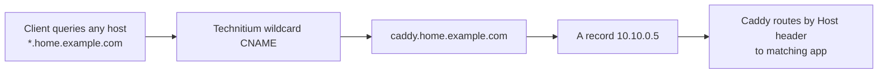

# Technitium Docker Deployment Guide

This guide deploys Technitium DNS using:
- [technitium_template.yaml](../docker-compose-files/technitium_template.yaml)

Compatibility note:
- 2GB RAM Pi 4 is supported with the included memory cap in the compose template.

## 1) Prepare env values
Update your `.env` with these required values:
- `DNS_BIND_IP=10.60.0.5`
- `TECHNITIUM_ADMIN_PASSWORD=<strong-password>`
- `TECHNITIUM_CONFIG_DIR=./appdata/technitium`

Optional but recommended values:
- `TECHNITIUM_MEM_LIMIT=512m`
- `TECHNITIUM_DNS_DOMAIN=home.arpa`
- `TECHNITIUM_BLOCKLIST_URLS=https://raw.githubusercontent.com/StevenBlack/hosts/master/hosts`

Tip:
- Relative bind paths (like `./appdata/...`) are resolved from the folder containing the rendered compose file (`docker-compose-files/`).

Create local bind-mount folder:
```bash
mkdir -p docker-compose-files/appdata/technitium
```

## 2) Render compose from template
Run:
```bash
./substitute_env.sh docker-compose-files/technitium_template.yaml docker-compose-files/technitium.yaml .env
```

## 3) Start stack
Run:
```bash
docker compose -f docker-compose-files/technitium.yaml up -d
```

## 4) First-time Technitium setup (required)
Open:
- `http://<DNS_BIND_IP>:5380`

Then configure:
1. Create primary zone `home.example.com`.
2. Add `A` record inside that zone:
   - Name: `caddy` (FQDN: `caddy.home.example.com`)
   - Address: `10.10.0.5`
3. Add wildcard `CNAME` inside that zone:
   - Name: `*` (FQDN: `*.home.example.com`)
   - Target: `caddy.home.example.com`
4. Add allowlist equivalent for `www.googleadservices.com`.

### Why wildcard CNAME (recommended)

Use a single wildcard `CNAME` (`*.home.example.com -> caddy.home.example.com`) instead of 26+ explicit CNAME records. This removes the need to add a new DNS record every time a new proxied service is added.

Caveats:
- Wildcard does not cover the zone apex (`home.example.com`) itself.
- Explicit records override wildcard — keep special cases as explicit entries.
- A typo hostname still resolves to Caddy (which returns 404/cert mismatch until configured there).
- Keep host-matching and auth policy in Caddy, since the DNS wildcard is broad by design.

Technitium UI tip: when editing records inside zone `home.example.com`, use relative names (`caddy`, `*`) rather than full FQDN labels.

DNS + proxy flow with wildcard:


## 5) pfSense integration
Keep DNS server IP as `10.60.0.5` to avoid changing existing DHCP and firewall dependencies.

For forced DNS across all VLANs:
- [pfsense-forced-dns-quick-entry.md](./pfsense-forced-dns-quick-entry.md)

For DoT/DoH hardening:
- [pfsense-dot-doh-blocking-quick-entry.md](./pfsense-dot-doh-blocking-quick-entry.md)

## 6) Validation
Run from clients on each VLAN:
```bash
nslookup google.com 10.60.0.5
nslookup proxmox.home.example.com 10.60.0.5
nslookup switchlite8poe.home.example.com 10.60.0.5
```

## 7) Common gotchas
- If Technitium fails to bind port 53, check for other DNS services on the host (for example `systemd-resolved`, `dnsmasq`, old Pi-hole container).
- If Caddy ACME DNS-01 fails with `expected 1 zone, got 0 for home.example.com`, your forced-DNS NAT is likely intercepting Caddy's resolver lookups.
  - Add `CADDY_HOST` alias and exclude it in the forced DNS NAT rule on Caddy's interface (source `!CADDY_HOST`, source port `any`).
  - Keep destination invert `!LOCAL_DNS`, destination port `53`, redirect to `LOCAL_DNS:53`.
  - See: [pfsense-forced-dns-all-vlans.md](./pfsense-forced-dns-all-vlans.md)
- If `http://<DNS_BIND_IP>:5380` is refused, run:
```bash
docker compose -f docker-compose-files/technitium.yaml ps technitium-dns
docker compose -f docker-compose-files/technitium.yaml port technitium-dns 5380
ss -ltnp | grep 5380 || true
```
  - Confirm `TECHNITIUM_WEB_BIND_IP` in `.env` is not `127.0.0.1`.
