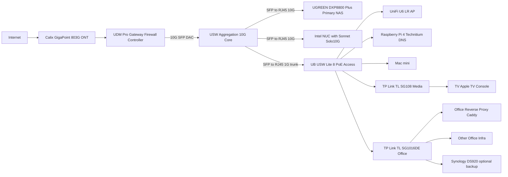

# Homelab UniFi + UGREEN DXP8800 Migration Guide

## 1. Scope
This document defines the target migration from current homelab network hardware to:
- UDM Pro
- USW-Aggregation
- Existing USW-Lite-8-PoE retained for AP/PoE/legacy 1G access
- UGREEN NASync DXP8800 Plus as primary NAS

This guide focuses on internal networking and 10GbE LAN performance.

## 2. Current-to-Target Replacement Map
| Current component | Target component | Change type |
|---|---|---|
| Netgate 1100 / pfSense | UDM Pro | Replace |
| UB-USW-LITE-8-POE (core role) | USW-Aggregation (core role) | Replace core role |
| UB-USW-LITE-8-POE (removed) | UB-USW-LITE-8-POE (access/PoE role) | Keep + repurpose |
| Synology DS920+ (primary NAS) | UGREEN DXP8800 Plus (primary NAS) | Replace primary role |
| DS920+ (optional) | DS920+ (backup/secondary role) | Keep optional |

## 3. Target Topology (MermaidJS)
This version is formatted to be accepted by mermaid.live.

## 4. Link Speeds and Expected Behavior
| Link | Expected speed | Notes |
|---|---|---|
| UDM Pro <-> USW-Aggregation | 10G | Use SFP DAC |
| USW-Aggregation <-> UGREEN DXP8800 Plus | 10G | Use SFP to RJ45 10G module on AGG side |
| USW-Aggregation <-> Intel NUC (Sonnet) | 10G | Aggregation side requires SFP to RJ45 10G module |
| USW-Aggregation <-> USW-Lite-8-PoE | 1G | Lite-8 has 1G RJ45 only |
| USW-Lite-8-PoE <-> U6-LR | 1G | AP uplink class is 1G |
| DS920+ path | 1G (or 2x1G LAG if configured) | Keep as secondary/backup during migration |

## 5. Gotchas and Constraints
### 5.1 UDM Pro IDS/IPS ceiling
- UDM Pro IDS/IPS throughput is 3.5 Gbps.
- This does not affect plain Layer 2 switching inside USW-Aggregation.
- It does affect routed and inspected traffic crossing VLANs through the gateway.

### 5.2 Keep high-throughput 10GbE flows in the same VLAN
- For fastest NUC <-> DXP8800 transfers, place both in the same VLAN (for example Office VLAN).
- Same-VLAN traffic stays switched at Layer 2 on USW-Aggregation and avoids UDM routing bottlenecks.
- Cross-VLAN bulk transfer can be constrained by gateway path and policy inspection.

### 5.3 USW-Aggregation is SFP-only
- USW-Aggregation has SFP+ ports only.
- RJ45 devices need SFP to RJ45 modules.
- In this design, plan for two 10G modules (DXP8800 + NUC) and one 1G module (Lite-8 uplink).

### 5.4 UGREEN DXP8800 Plus interface and form factor
- DXP8800 Plus has dual 10GbE RJ45 ports, so it integrates cleanly with copper 10G.
- With USW-Aggregation, each 10GbE RJ45 NAS link consumes one SFP to RJ45 10G module on the switch side.
- DXP8800 Plus is not a rackmount chassis by default; plan shelf space.

### 5.5 Retained 1G edge remains intentional
- Keeping USW-Lite-8-PoE for AP, Raspberry Pi, and legacy endpoints is valid.
- This prevents overpaying for 10G where throughput demand is low.

## 6. Recommended VLAN Placement for Performance
1. Keep `NUC` and `DXP8800 Plus` in the same high-throughput VLAN.
2. Keep AP/IoT/Guest/Media segmentation unchanged behind access switching.
3. Allow only required inter-VLAN flows to NAS from other segments.
4. Keep DNS and reverse-proxy policy behavior aligned with existing intent.

## 7. Migration Sequence (Low Risk)
1. Rack and adopt UDM Pro, but keep old path available until validation completes.
2. Rack and adopt USW-Aggregation; establish 10G UDM <-> AGG uplink.
3. Move NUC to AGG using Sonnet adapter + SFP to RJ45 module.
4. Move USW-Lite-8-PoE uplink to AGG (1G trunk expected).
5. Bring DXP8800 Plus online and validate 10G path from NUC.
6. Migrate NAS workloads from DS920+ to DXP8800 Plus.
7. Keep DS920+ as backup/secondary until cutover confidence is high.

## 8. Validation Checklist
1. Confirm NUC link shows 10,000 Mbps.
2. Confirm DXP8800 uplink is 10GbE to AGG module port.
3. Confirm AGG <-> Lite8 trunk is up at 1G with required VLANs.
4. Run `iperf3` and large SMB/NFS copy tests NUC <-> DXP8800.
5. Test cross-VLAN access controls still match policy intent.
6. Confirm DNS and reverse-proxy paths still function end-to-end.

## 9. Shopping List and Cost (South Africa)
Pricing reference date: 2026-03-22. Prices and stock can change quickly.

### 9.1 Core equipment
| Item | Qty | Unit Price (incl. VAT) | Subtotal | Buy link |
|---|---:|---:|---:|---|
| UDM Pro (`UDM-PRO`) | 1 | R9,061 | R9,061 | [GeeWiz](https://www.geewiz.co.za/gigabit-ethernet/120540-ubiquiti-unifi-dream-machine-pro-8-port-gigabit-switch-with-2sfp-udm-pro.html) |
| USW-Aggregation (`USW-AGG`) | 1 | R6,328 | R6,328 | [GeeWiz](https://www.geewiz.co.za/new-items/481722-ubiquiti-unifi-aggregation-switch-8sfp-usw-aggregation.html) |
| UGREEN DXP8800 Plus (`DXP8800PLUS-35127B`) | 1 | R23,819 | R23,819 | [Chaos Computers](https://chaoscomputers.co.za/product/ugreen-nasync-dxp8800-plus-8-bay-nas/) |

Core subtotal: **R39,208**

### 9.2 Migration accessories and adapter
| Item | Qty | Unit Price (incl. VAT) | Subtotal | Buy link |
|---|---:|---:|---:|---|
| Sonnet Solo10G TB3 to RJ45 (`SOLO10G-TB3`) | 1 | R5,299 | R5,299 | [FirstShop](https://www.firstshop.co.za/products/sonnet-solo10g-thunderbolt-3-to-rj45-10gbe-ethernet-adapter-solo10g-tb3-334633) |
| Ubiquiti 10G DAC 1m (`UB-DAC-SFP10-1M`) | 1 | R403 | R403 | [GeeWiz](https://www.geewiz.co.za/networking-cablestoolspatch-panel/188808-ubiquiti-unifi-10-gbps-direct-attach-cable-1m.html) |
| Ubiquiti SFP+ to RJ45 10G (`UB-UF-RJ45-MG`) | 2 | R1,621 | R3,242 | [GeeWiz](https://www.geewiz.co.za/networking-cablestoolspatch-panel/195631-ubiquiti-10g-sfp-to-10525gbe-rj45-module.html) |
| Ubiquiti SFP to RJ45 1G (`UACC-CM-RJ45-1G`) | 1 | R404 | R404 | [GeeWiz](https://www.geewiz.co.za/new-items/481072-ubiquiti-125g-sfp-to-rj45-gigabit-ethernet-module-uacc-cm-rj45-1g.html) |

Accessories subtotal: **R9,348**

### 9.3 Estimated total
**Grand total (incl. VAT): R48,556**

### 9.4 Not included in total
- HDD/SSD drives for DXP8800 Plus
- Rack, PDU, and UPS
- Cat6a patch leads and longer structured cabling
- Any optional spare modules/cables

### 9.5 Stock status notes
- FirstShop listing for `SOLO10G-TB3` was shown as backordered/unavailable at time of check.
- GeeWiz stock is mostly listed as external supplier stock and can change during checkout.
- DXP8800 Plus pricing and stock vary significantly across South African retailers.
